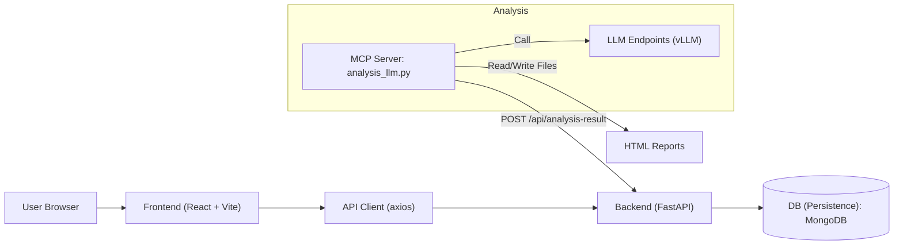
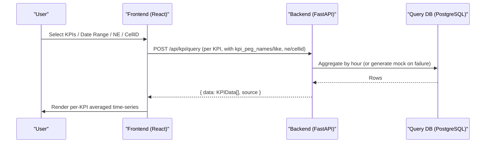
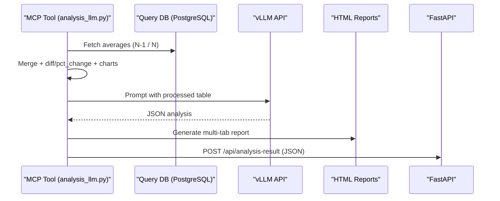

# Architecture & Data Flow

## System Architecture

- Persistence DB: 분석결과/환경설정 영구 저장(필수). 환경변수 `MONGO_URL`, `MONGO_DB_NAME`
- Query DB: 통계 조회 대상(선택). 현 버전에서는 `/api/kpi/query`가 mock 생성기를 사용하며, 추후 실제 프록시 통합 가능

## KPI Data Flow (Dashboard/Statistics)

## Analysis Flow (N-1 vs N)

## Key Endpoints
- POST `/api/kpi/query`: 시간 단위 평균(mock). 필터 파라미터 수집만 수행
- POST `/api/kpi/statistics/batch`: 다중 KPI mock
- POST `/api/db/ping`: DB 연결 테스트
- POST `/api/master/ne-list`, `/api/master/cellid-list`: 자동완성용 DISTINCT 조회
- Preferences: `GET/POST/PUT/DELETE /api/preferences`, `GET/PUT /api/preferences/{id}/derived-pegs`
