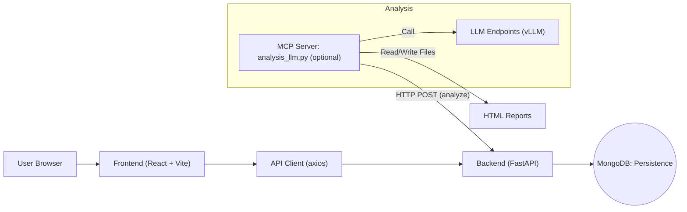
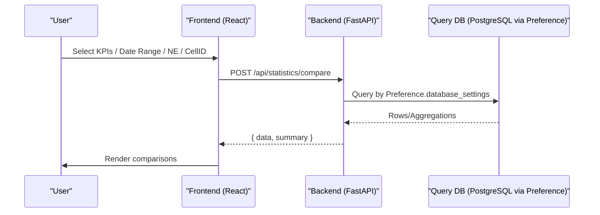
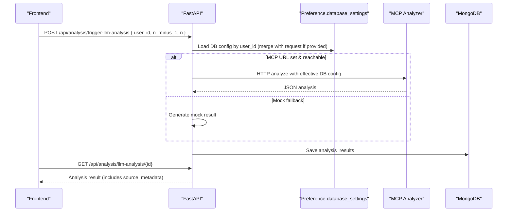

# Architecture & Data Flow

## System Architecture

- Persistence DB: 분석결과/환경설정 영구 저장. `MONGO_URL`, `MONGO_DB_NAME`
- Preference: `user_preferences.database_settings`에 PostgreSQL 설정(host/port/user/password/dbname/table)
- LLM 호출: `MCP_ANALYZER_URL` 설정 시 실제 호출, 미설정/실패 시 Mock 폴백

## KPI Data Flow (Dashboard/Statistics)

## LLM Analysis Flow (N-1 vs N)

## Key Endpoints (excerpt)
- POST `/api/analysis/trigger-llm-analysis`: Preference 기반 DB 설정 자동 주입, MCP 우선/Mock 폴백
- GET `/api/analysis/llm-analysis/{id}`: 단건 결과 조회
- Preferences: `GET/PUT /api/preference/settings?user_id=...` (databaseSettings 포함)
