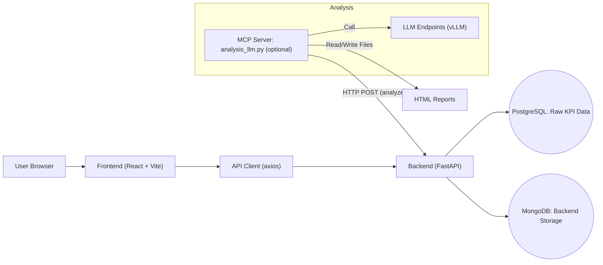
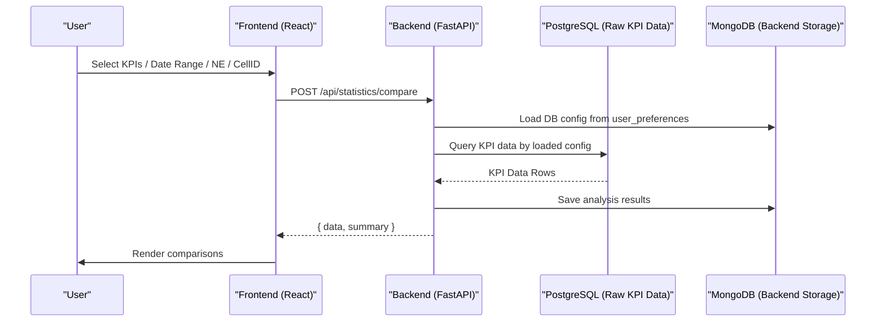
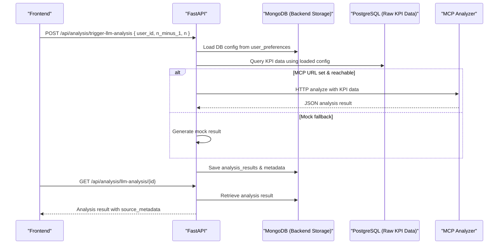
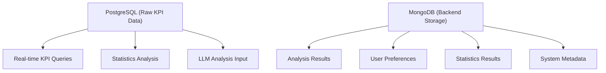

# Architecture & Data Flow

## System Architecture


- **PostgreSQL (Raw KPI Data)**: 실시간 KPI/PEG 데이터 저장 및 조회. 환경변수: `DB_HOST`, `DB_PORT`, `DB_USER`, `DB_PASSWORD`, `DB_NAME`
- **MongoDB (Backend Storage)**: 분석결과/사용자설정/통계결과 영구 저장. 환경변수: `MONGO_URL`, `MONGO_DB_NAME`
- **Preference**: `user_preferences.database_settings`에 PostgreSQL 연결 설정 저장
- **LLM 호출**: `MCP_ANALYZER_URL` 설정 시 실제 호출, 미설정/실패 시 Mock 폴백

## KPI Data Flow (Dashboard/Statistics)


## LLM Analysis Flow (N-1 vs N)


## Key Endpoints (excerpt)
- **POST `/api/analysis/trigger-llm-analysis`**: MongoDB에서 사용자 설정 로드 → PostgreSQL에서 KPI 데이터 조회 → MCP 분석 실행 → MongoDB에 결과 저장
- **GET `/api/analysis/llm-analysis/{id}`**: MongoDB에서 분석 결과 조회 (KPI 데이터는 PostgreSQL에서 실시간 조회)
- **GET `/api/analysis/results`**: 분석 결과 목록 조회 (페이지네이션, 필터링 지원)
- **DELETE `/api/analysis/results/{id}`**: 분석 결과 삭제
- **POST `/api/statistics/compare`**: MongoDB에서 설정 로드 → PostgreSQL에서 KPI 비교 분석 → MongoDB에 결과 저장
- **Preferences**: `GET/PUT /api/preference/settings?user_id=...` (PostgreSQL 연결 설정을 MongoDB에 저장)

## Frontend Component Architecture

#### 분석결과 메뉴 컴포넌트 구조
```
ResultsList (메인 목록)
├── useAnalysisResults (커스텀 훅)
├── ResultFilter (필터링)
├── ResultDetail (상세보기 모달)
│   ├── 마할라노비스 거리 분석
│   ├── PEG 비교 분석
│   ├── Mann-Whitney U Test
│   ├── Kolmogorov-Smirnov Test
│   └── Choi 알고리즘 판정
└── AnalysisResultsViewer (범용 뷰어)
```

#### 주요 컴포넌트 특징
- **ResultsList.jsx**: 목록 표시, 정렬, 선택, 삭제 기능
- **ResultDetail.jsx**: 고급 알고리즘 분석 결과 표시, 메모리 최적화
- **ResultFilter.jsx**: 다중 필터링, 빠른 날짜 선택
- **AnalysisResultsViewer.jsx**: 범용 결과 표시 (statistics/llm/trend)

## Database Architecture


*문서 업데이트: 2025-01-14 (PostgreSQL+KPI + MongoDB+Storage 구조 반영)*
