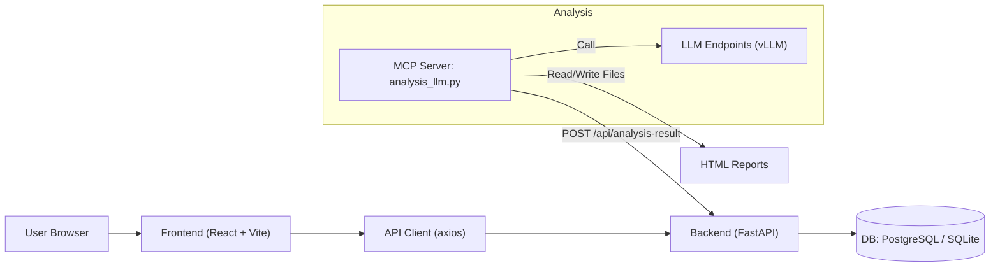
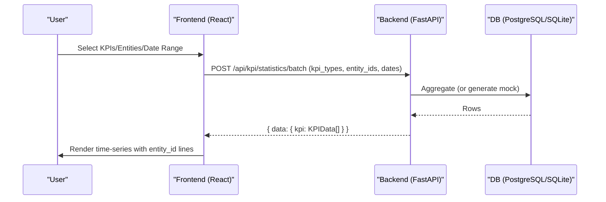
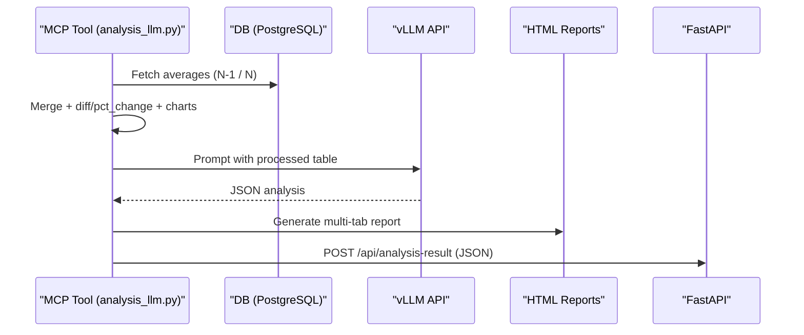

# Architecture & Data Flow

## System Architecture

```mermaid
graph LR
  A["User Browser"] --> B["Frontend (React + Vite)"]
  B --> C["API Client (axios)"]
  C --> D["Backend (FastAPI)"]
  D --> E[("DB: PostgreSQL / SQLite")]
  subgraph Analysis
    F["MCP Server: analysis_llm.py"]
    G["LLM Endpoints (vLLM)"]
  end
  F -- "POST /api/analysis-result" --> D
  F -- "Read/Write Files" --> H["HTML Reports"]
  F -- "Call" --> G
```

## KPI Data Flow (Dashboard/Statistics)

```mermaid
sequenceDiagram
  participant U as "User"
  participant FE as "Frontend (React)"
  participant BE as "Backend (FastAPI)"
  participant DB as "DB (PostgreSQL/SQLite)"

  U->>FE: Select KPIs/Entities/Date Range
  FE->>BE: POST /api/kpi/statistics/batch (kpi_types, entity_ids, dates)
  BE->>DB: Aggregate (or generate mock)
  DB-->>BE: Rows
  BE-->>FE: { data: { kpi: KPIData[] } }
  FE->>U: Render time-series with entity_id lines
```

## Analysis Flow (N-1 vs N)

```mermaid
sequenceDiagram
  participant Tool as "MCP Tool (analysis_llm.py)"
  participant DB as "DB (PostgreSQL)"
  participant LLM as "vLLM API"
  participant HTML as "HTML Reports"
  participant BE as "FastAPI"

  Tool->>DB: Fetch averages (N-1 / N)
  Tool->>Tool: Merge + diff/pct_change + charts
  Tool->>LLM: Prompt with processed table
  LLM-->>Tool: JSON analysis
  Tool->>HTML: Generate multi-tab report
  Tool->>BE: POST /api/analysis-result (JSON)
```
